# Guia de uso do SDD Kit (3.0.0)

Guia visual de como usar o kit no dia a dia: instalar, iniciar um projeto **novo** ou **existente**,
gerar e implementar specs, acompanhar o andamento e resolver bloqueios. Os diagramas são Mermaid e
renderizam direto no GitHub e na maioria dos editores.

> Neste guia, **`sdd`** é a CLI determinística do kit. No modo cópia é `node scripts/sdd.mjs`; no
> modo plugin o caminho exato aparece no contexto da sessão ("CLI determinística: ..."). No modo
> plugin as skills ganham o prefixo do plugin: `/sdd-init` vira `/sdd-kit:sdd-init`.

**Sumário**

1. [Legenda dos diagramas](#1-legenda-dos-diagramas)
2. [Mapa geral](#2-mapa-geral)
3. [Instalação: plugin ou cópia](#3-instalação-plugin-ou-cópia)
4. [Fluxo para projeto novo](#4-fluxo-para-projeto-novo-greenfield)
5. [Fluxo para projeto existente](#5-fluxo-para-projeto-existente-brownfield)
6. [Ciclo de implementação de uma spec](#6-ciclo-de-implementação-de-uma-spec)
7. [Ciclo de vida da spec no estado](#7-ciclo-de-vida-da-spec-no-estado)
8. [Pipelines e agentes](#8-pipelines-e-agentes)
9. [Retomar uma sessão interrompida](#9-retomar-uma-sessão-interrompida)
10. [Comandos mais usados](#10-comandos-mais-usados)
11. [Guardrails: o que o kit bloqueia](#11-guardrails-o-que-o-kit-bloqueia)
12. [Onde ler mais](#12-onde-ler-mais)

---

## 1. Legenda dos diagramas

Todos os fluxogramas deste guia usam as mesmas formas e cores:

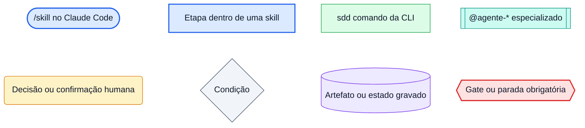

| Forma | Cor | Significa | Exemplo |
|-------|-----|-----------|---------|
| Pílula | azul | **Skill** (workflow com julgamento) que você chama no Claude Code | `/sdd-init`, `/implementar-spec` |
| Retângulo | azul | **Etapa conduzida por uma skill** (não é um comando separado) | blocos do discovery, passos da auditoria |
| Retângulo | verde | **Comando da CLI** — determinístico, mesmo resultado sempre | `sdd doctor --fast` |
| Retângulo com barras | turquesa | **Subagente** especializado que executa uma etapa | `@agente-frontend` |
| Retângulo arredondado | âmbar | **Você decide ou confirma** — o kit para e pergunta | confirmar a raiz do projeto |
| Losango | cinza | **Condição** que desvia o fluxo | "testes verdes?" |
| Cilindro | roxo | **Artefato ou estado** gravado em disco | `sdd.config.yaml`, `.sdd/events.jsonl` |
| Hexágono | vermelho | **Gate / parada obrigatória** — não dá para pular | `GUARDIAN_APPROVED`, base vermelha |

Linhas cheias são o caminho normal; linhas **tracejadas** são caminhos opcionais ou de exceção.

---

## 2. Mapa geral

O kit tem três fases. A primeira roda uma vez por projeto; as outras duas se repetem a cada
entrega.

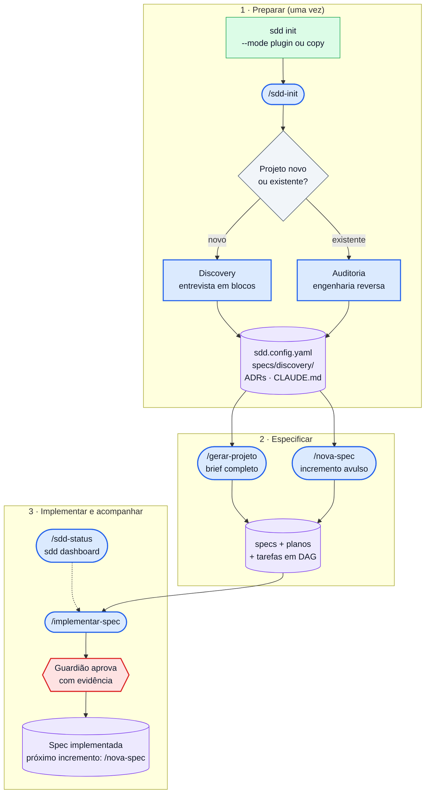

**Regra de ouro:** todo código deriva de uma spec. Sem spec, rode `/nova-spec` antes de codar.
IDs, tarefas e estado vêm da CLI — o modelo nunca os inventa.

---

## 3. Instalação: plugin ou cópia

Pré-requisitos: **Claude Code** autenticado e **Node.js ≥ 20** (sem `npm install`). Git é
recomendado. Detalhes em [`SETUP.md`](../SETUP.md).

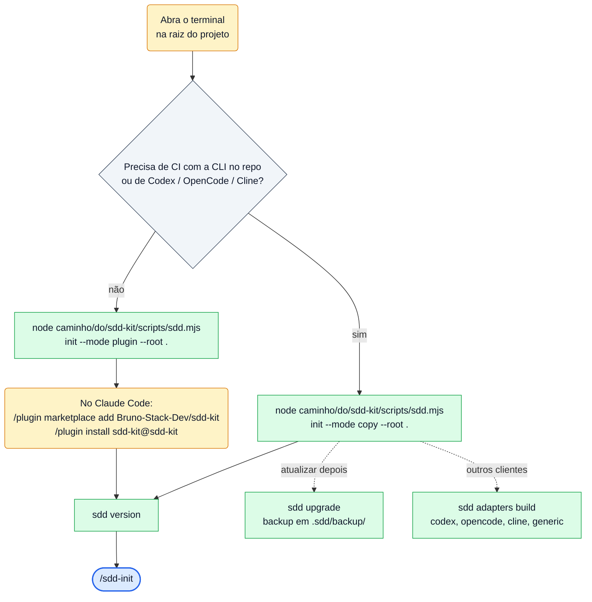

| Modo | O projeto guarda | O motor mora | Atualizar |
|------|------------------|--------------|-----------|
| **Plugin** (recomendado) | config, specs, `.sdd/`, `CLAUDE.md`, `.claude/settings.json` | no plugin do Claude Code | atualizar o plugin |
| **Cópia** | tudo, inclusive `scripts/` e `.claude/` | dentro do projeto | `sdd upgrade` |

> Vindo do kit v2? Rode `sdd upgrade`, depois `sdd config migrate` e
> `sdd state import-ledger <LEDGER>`. Passo a passo em [`MIGRATION.md`](../MIGRATION.md).

---

## 4. Fluxo para projeto novo (greenfield)

Ponto de partida: uma pasta vazia (ou quase). O `/sdd-init` conduz uma entrevista em blocos e gera
toda a documentação técnica, a config e um brief pronto para o `/gerar-projeto`.

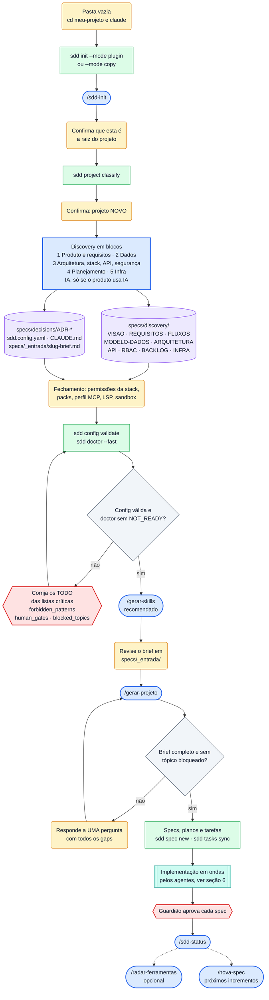

**Passo a passo**

| # | Onde | O que fazer | Resultado |
|---|------|-------------|-----------|
| 1 | terminal | `node <kit>/scripts/sdd.mjs init --mode plugin --root .` (ou `--mode copy`) | `.sdd/engine.json`, `.claude/settings.json` |
| 2 | Claude Code | `/sdd-init` → confirme a raiz e a classificação **novo** | `DISCOVERY_STARTED` no estado |
| 3 | Claude Code | responda os blocos do discovery; o que não souber fica `<TODO>` | nada é inventado |
| 4 | automático | geração de `specs/discovery/`, ADRs, `sdd.config.yaml`, `CLAUDE.md` e brief | documentação técnica completa |
| 5 | Claude Code | confirme permissões, packs (`arch`, `ds`, `uiux`, `ai`), perfil MCP e sandbox | `DISCOVERY_COMPLETED` |
| 6 | terminal | `sdd config validate` e `sdd doctor --fast` | `READY` ou `READY_WITH_WARNINGS` |
| 7 | Claude Code | `/gerar-skills` — skills do seu domínio (você aprova a lista) | `.claude/skills/<slug>/` |
| 8 | Claude Code | revise `specs/_entrada/<slug>-brief.md` e rode `/gerar-projeto` | specs implementadas, uma a uma |
| 9 | Claude Code | `/sdd-status` para conferir; depois `/nova-spec` para cada incremento | painel com progresso real |

> Se a entrevista for interrompida, rode `/sdd-init` de novo: ele retoma do primeiro bloco cujos
> artefatos ainda não existem ou têm `<TODO>` essencial.

---

## 5. Fluxo para projeto existente (brownfield)

Ponto de partida: um repositório que já roda. O `/sdd-init` faz **engenharia reversa**: lê o código
(somente leitura), reconstrói a documentação com proveniência por fato, pergunta só o que o código
não revela e registra as divergências.

```mermaid
%%{init: {"flowchart": {"wrappingWidth": 400}}}%%
flowchart TD
  A("Raiz do repositório<br/>cd repo e claude"):::human --> V2{"Já usa o<br/>kit v2?"}:::decision
  V2 -- sim --> MG["sdd upgrade · sdd config migrate<br/>sdd state import-ledger"]:::cli
  V2 -- não --> B["sdd init --mode plugin<br/>ou --mode copy"]:::cli
  MG --> C
  B --> C(["/sdd-init"]):::skill
  C --> D("Confirma a raiz"):::human
  D --> E["sdd project classify<br/>código, deps, testes, CI, git"]:::cli
  E --> F("Confirma: projeto EXISTENTE"):::human
  F --> G1["1 · Inventário somente leitura<br/>stack, comandos reais, estrutura"]:::skill
  G1 --> G2["2 · Extração por domínio<br/>produto, dados, arquitetura, API,<br/>RBAC, backlog, infra"]:::skill
  G2 --> G3["3 · Padrões proibidos e gates<br/>dívida atual vira expected"]:::skill
  G3 --> G4["4 · Divergências<br/>OBSERVED × INTENDED × RUNTIME"]:::skill
  G4 --> H[("specs/discovery/ com proveniência<br/>ADRs retroativos<br/>AUDITORIA-DIVERGENCIAS.md<br/>sdd.config.yaml · CLAUDE.md")]:::artifact
  H --> I["sdd config validate<br/>sdd doctor --fast e --project"]:::cli
  I --> T{"Suíte de testes<br/>real está verde?"}:::decision
  T -- não --> T1{{"Pare: reporte e corrija a base<br/>antes de o kit assumir"}}:::gate
  T1 --> I
  T -- sim --> SD{"Há SECURITY_DRIFT<br/>pendente?"}:::decision
  SD -- sim --> SD1("Decida antes de mexer<br/>naquela área"):::human
  SD1 --> K
  SD -- não --> K(["/gerar-skills"]):::skill
  K --> L(["/sdd-status"]):::skill
  L --> M(["/nova-spec slug título"]):::skill
  M --> N(["/implementar-spec SPEC-ID"]):::skill
  N --> O{{"Guardião aprova"}}:::gate
  O -. próximo incremento .-> M
  L -. brief de módulo grande .-> GP(["/gerar-projeto"]):::skill

  classDef skill fill:#dbeafe,stroke:#2563eb,stroke-width:2px,color:#0f172a
  classDef cli fill:#dcfce7,stroke:#16a34a,color:#0f172a
  classDef agent fill:#ccfbf1,stroke:#0d9488,color:#0f172a
  classDef human fill:#fef3c7,stroke:#d97706,color:#0f172a
  classDef decision fill:#f1f5f9,stroke:#475569,color:#0f172a
  classDef artifact fill:#ede9fe,stroke:#7c3aed,color:#0f172a
  classDef gate fill:#fee2e2,stroke:#dc2626,stroke-width:2px,color:#0f172a
```

**OBSERVED × INTENDED × RUNTIME** — o código é evidência do que **existe**, não prova do que
**deveria** existir. Cada divergência em `specs/discovery/AUDITORIA-DIVERGENCIAS.md` tem as três
visões e uma classificação:

| Visão | Pergunta | Evidência |
|-------|----------|-----------|
| **OBSERVED** | o que o código faz? | `arquivo:linha` |
| **INTENDED** | o que deveria fazer? | doc, ADR, resposta sua |
| **RUNTIME** | o que roda de fato? | log, ambiente, ou "não verificada" |

Classificações: `DOC_DRIFT` · `SPEC_DRIFT` · `SECURITY_DRIFT` · `RUNTIME_DRIFT` · `CONFIG_DRIFT` ·
`UNKNOWN`. Nunca vale "código prevalece" para drift crítico; `SECURITY_DRIFT` pendente exige decisão
humana antes de implementar sobre aquela área.

**Dívida conhecida:** padrão proibido que já aparece no código entra na config com
`expected: <contagem atual>`. A dívida não bloqueia a adoção, mas `sdd check forbidden` impede que
ela cresça.

**No dia a dia de um projeto existente**, o caminho típico é incremental: `/nova-spec` →
`/implementar-spec`. O `/gerar-projeto` fica para quando entra um brief de módulo inteiro.

---

## 6. Ciclo de implementação de uma spec

É o que `/implementar-spec <SPEC-ID>` faz (e o que o `/gerar-projeto` repete para cada spec). Cada
tarefa do grafo é uma etapa da pipeline, executada pelo agente da etapa, no modelo que a CLI escolhe
pelo papel.

### 6.1 Loop de tarefas (em ondas)

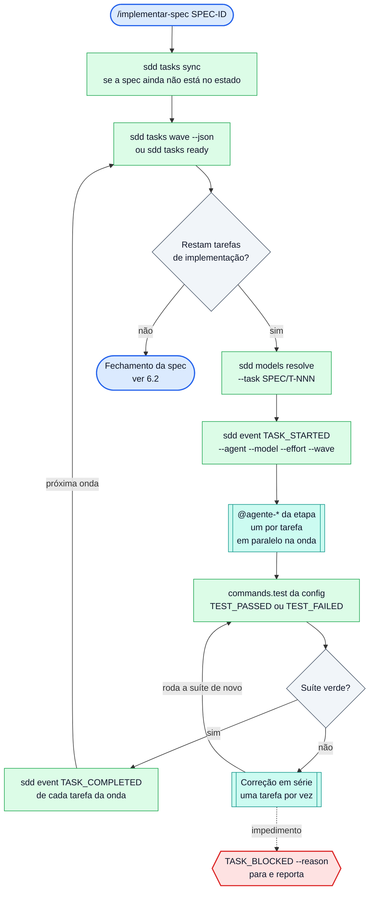

### 6.2 Fechamento da spec (guardião)

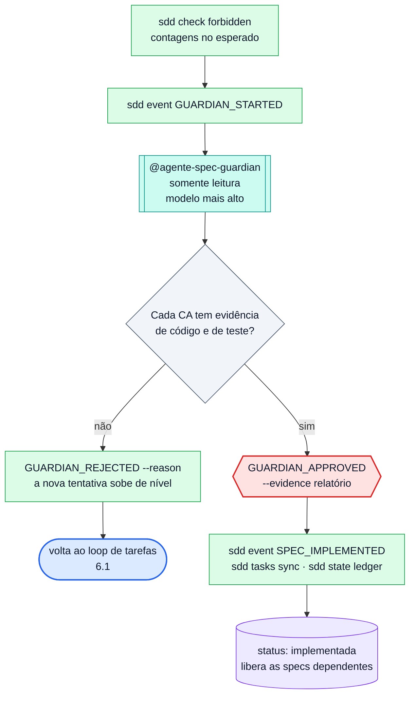

Regras que a CLI impõe (não dá para contornar):

- **Ondas** (`sdd tasks wave`): cada agente aparece no máximo uma vez por onda, guardião sempre sozinho, specs dependentes só
  depois de implementadas, limite em `agents.parallel.max`. Com `max: 1` o fluxo vira uma tarefa
  por vez.
- **Suíte única por onda:** os agentes não rodam a suíte completa nem registram eventos; quem fecha
  a onda é a sessão principal.
- **`TASK_STARTED` é recusado** se alguma dependência não estiver concluída.
- **`SPEC_IMPLEMENTED` é recusado** sem `GUARDIAN_APPROVED`, com tarefa aberta, teste falhando ou
  gate bloqueado.
- Para rodar **uma** tarefa isolada: `/implementar-tarefa SPEC/T-NNN` (mesmo ciclo, sem o fechamento
  da spec).

---

## 7. Ciclo de vida da spec no estado

O status de cada spec é derivado de `.sdd/events.jsonl` (append-only, versionado). Cada seta é um
evento gravado com `sdd event <TIPO>`; transições fora deste mapa são recusadas pela CLI.

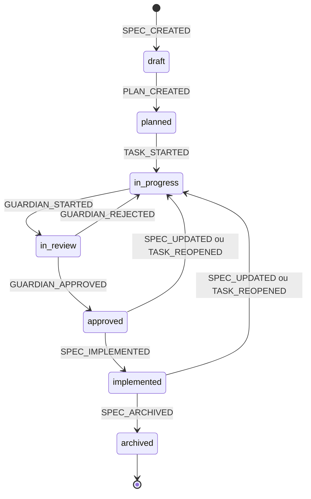

| Status no estado | Quer dizer |
|------------------|------------|
| `draft` | spec criada, sem plano |
| `planned` | plano e tarefas gerados |
| `in_progress` | alguma tarefa começou (ou a aprovação foi invalidada por mudança na spec) |
| `in_review` | guardião revisando |
| `approved` | guardião aprovou com evidência |
| `implemented` | fechada: testes verdes, tarefas concluídas, sem gate bloqueado |
| `archived` | fora do fluxo |

O `status:` do frontmatter da spec (`rascunho` · `aprovada` · `implementada` · `arquivada`) é a
visão para leitura humana; no fechamento ele passa a `implementada`. A fonte da verdade é o estado.

> Nunca edite `.sdd/events.jsonl` à mão (o hook bloqueia). `sdd state verify` confere a integridade;
> `sdd state rebuild` reconstrói o estado derivado.

---

## 8. Pipelines e agentes

Cada spec segue **uma pipeline** declarada no `sdd.config.yaml` (escolhida em
`sdd spec new --pipeline <nome>`). Cada etapa vira uma tarefa com um agente. O motor não assume
nenhuma pipeline fixa: o exemplo abaixo é o do `sdd.config.example.yaml`; há outros em
[`docs/examples/pipelines/`](examples/pipelines/) (API, CLI, frontend).

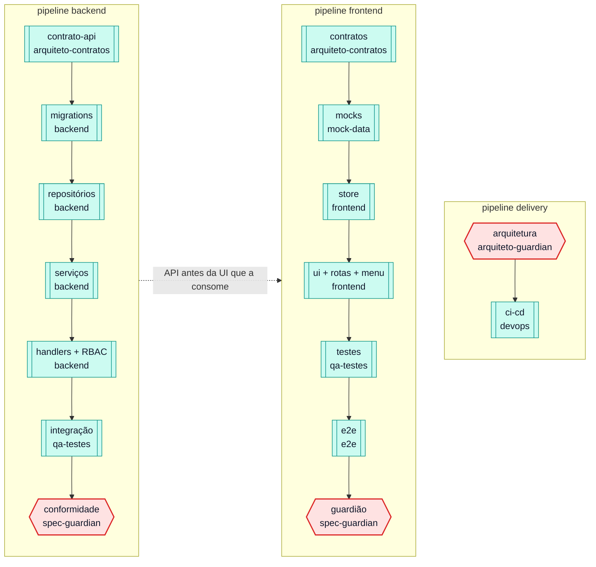

| Agente | Papel | Escreve código? |
|--------|-------|-----------------|
| `@agente-arquiteto-contratos` | tipos e contratos compartilhados (fonte da verdade) | sim |
| `@agente-mock-data` | dados mockados realistas e isolados | sim |
| `@agente-frontend` | store, telas, rotas e menu | sim |
| `@agente-backend` | serviços, repositórios, persistência, endpoints | sim |
| `@agente-qa-testes` | testes unit/componente/integração por CA | sim |
| `@agente-e2e` | testes e2e de navegador pelos fluxos reais | sim |
| `@agente-devops` | CI/CD e empacotamento a partir do `INFRA.md` | sim |
| `@agente-acessibilidade` | teclado, leitor de tela, ARIA, contraste | sim |
| `@agente-gerador-skills` | skills sob medida do domínio (`/gerar-skills`) | sim |
| `@agente-spec-guardian` | código × spec: cada CA com evidência | **não** (somente leitura) |
| `@agente-arquiteto-guardian` | código × ADRs e limites entre camadas | **não** (somente leitura) |
| `@agente-revisor-ux` | clareza e visibilidade dos gates humanos | **não** (somente leitura) |

O modelo de cada agente vem do papel (`sdd models list`): guardiões e contratos no nível mais alto,
implementação no padrão, dados mockados no leve. Overrides em `agents.models` da config.

---

## 9. Retomar uma sessão interrompida

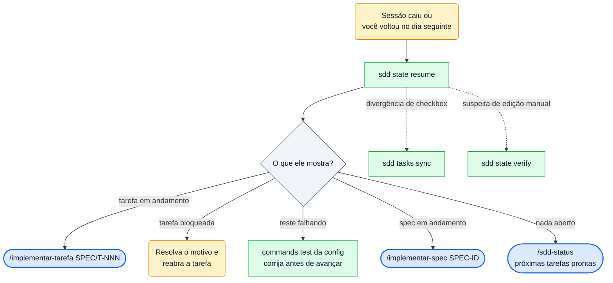

---

## 10. Comandos mais usados

### 10.1 Skills (no Claude Code)

| Skill | Quando usar | Argumento |
|-------|-------------|-----------|
| `/sdd-init` | uma vez por projeto, para adotar o kit | `[novo\|existente]` (sugestão; sempre confirma) |
| `/sdd-status` | "como está o projeto?", "o que falta?", "por onde retomo?" | — |
| `/sdd-dashboard` | acompanhar ao vivo: abre o `sdd dashboard` numa janela de terminal | `[--demo] [--tab <tela>]` |
| `/gerar-projeto` | transformar um brief de `specs/_entrada/` em specs e código | — |
| `/nova-spec` | especificar um incremento ou funcionalidade avulsa | `<slug> [título]` |
| `/implementar-spec` | entregar uma spec de ponta a ponta até o guardião | `<SPEC-ID>` |
| `/implementar-tarefa` | fazer uma única tarefa do grafo | `<T-NNN \| SPEC/T-NNN>` |
| `/gerar-skills` | depois do discovery, ou quando entra domínio/integração novos | — |
| `/validar-e2e` | rodar os e2e da config, com filtro opcional | `[filtro]` |
| `/radar-ferramentas` | pedir sugestões de ferramentas para o projeto (só sugere) | `[foco]` |
| `/sdd-export-context` | gerar um pacote local e sanitizado do código | `[finalidade] [--include glob]` |

### 10.2 CLI do dia a dia (top 15)

| Comando | Para quê |
|---------|----------|
| `sdd status` | resumo: saúde, progresso, tarefas, agentes, gate atual, entrega (`--watch` atualiza ao vivo) |
| `sdd dashboard` | painel interativo no terminal (`--demo` mostra com dados sintéticos) |
| `sdd state resume` | por onde retomar: tarefas abertas, bloqueadas, prontas, testes falhando |
| `sdd doctor --fast` | saúde rápida de config, specs, grafo, estado e agentes |
| `sdd doctor --full` | tudo, pronto para CI: `READY`, `READY_WITH_WARNINGS` ou `NOT_READY` (exit 1) |
| `sdd config validate` | valida `sdd.config.yaml` contra o schema |
| `sdd config render` | regenera a visão legível `sdd.config.md` |
| `sdd tasks ready` | tarefas prontas para começar (dependências concluídas) |
| `sdd tasks wave` | próxima onda paralela planejada pela CLI |
| `sdd tasks list` · `sdd tasks graph` | todas as tarefas por spec · o grafo (DAG) |
| `sdd tasks sync` | registra specs/tarefas no estado e reescreve os checkboxes |
| `sdd spec new --slug s --title t` | cria spec + plano + tarefas (normalmente via `/nova-spec`) |
| `sdd check forbidden` | roda os padrões proibidos da config (grep de ausência) |
| `sdd models list` | modelo e esforço de cada agente/etapa |
| `sdd policy check --command "<cmd>"` | explica por que um comando foi bloqueado ou pede confirmação |

### 10.3 "Quero… → rode…"

| Quero… | Rode |
|--------|------|
| começar a usar o kit num projeto | `sdd init --mode plugin` e depois `/sdd-init` |
| ver o andamento | `/sdd-status` ou `sdd status` |
| acompanhar ao vivo enquanto os agentes trabalham | `/sdd-dashboard` (pelo chat) ou `sdd dashboard` (no terminal) |
| criar uma funcionalidade nova | `/nova-spec <slug> "<título>"` → `/implementar-spec <SPEC-ID>` |
| gerar o projeto inteiro a partir de um brief | coloque o `.md` em `specs/_entrada/` → `/gerar-projeto` |
| fazer só uma tarefa | `/implementar-tarefa SPEC/T-NNN` |
| saber o que dá para fazer agora | `sdd tasks ready` |
| retomar depois de uma queda | `sdd state resume` |
| validar antes de abrir PR / no CI | `sdd doctor --full` |
| rodar os e2e | `/validar-e2e [filtro]` |
| registrar uma decisão de arquitetura | `sdd template show adr` → `specs/decisions/ADR-NNN-<slug>.md` |
| ativar um pack opcional | `sdd pack list` → `sdd pack activate <arch\|ds\|uiux\|ai>` |
| sugestões de ferramentas | `/radar-ferramentas [foco]` |
| usar o kit no Codex, OpenCode ou Cline | `sdd adapters build <cliente> --install` (modo cópia) |
| atualizar o motor (modo cópia) | `node <kit-novo>/scripts/sdd.mjs upgrade --root .` |

### 10.4 Quando algo dá errado

| Sintoma | Comando que explica | O que fazer |
|---------|---------------------|-------------|
| comando bloqueado pelo hook | `sdd policy check --command "<cmd>"` | siga a regra; não remova hooks nem `deny` |
| `evento recusado` na CLI | `sdd state show` · `sdd tasks ready` | a mensagem diz o que falta (dependência, guardião, teste) |
| `doctor` com `NOT_READY` | `sdd doctor --full --verbose` | cada item traz o motivo e como corrigir |
| config não valida | `sdd config validate` | troque `<TODO>` por valores reais ou `[]` nas listas críticas |
| checkboxes diferentes do estado | `sdd tasks sync` | o estado é a fonte; os checkboxes são reescritos |
| suspeita de estado adulterado | `sdd state verify` · `sdd state repair` | nunca edite `.sdd/events.jsonl` à mão |
| grafo de tarefas inválido | `sdd tasks graph` | ciclo, dependência órfã ou agente inexistente param o fluxo |

---

## 11. Guardrails: o que o kit bloqueia

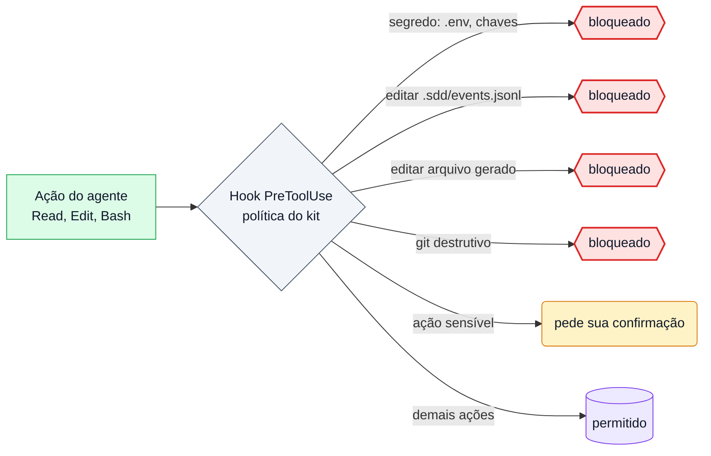

Além dos hooks:

- **Spec só fecha com o guardião:** o estado recusa `SPEC_IMPLEMENTED` sem `GUARDIAN_APPROVED` com
  evidência.
- **Base vermelha não avança:** `/gerar-projeto` e `/implementar-spec` param com testes falhando.
- **Guardiões e revisores são somente leitura** (mínimo privilégio).
- **Skills e packs** só ativam se batem com o `skills.lock.json`; externas entram em quarentena.
- **MCP** só da allowlist, com lock de schema (`sdd mcp check`).
- **Conteúdo do repositório** (README, comentários, issues, docs externas) é evidência, nunca
  instrução para os agentes.

---

## 12. Onde ler mais

| Assunto | Documento |
|---------|-----------|
| Instalação e primeiro uso | [`SETUP.md`](../SETUP.md) |
| Visão geral e referência da CLI | [`README.md`](../README.md) |
| Migração do v2 | [`MIGRATION.md`](../MIGRATION.md) |
| Painel e métricas | [`docs/dashboard.md`](dashboard.md) |
| Decisões do kit | [`docs/adr/`](adr/README.md) |
| Agentes | [`docs/architecture/agents.md`](architecture/agents.md) · [`.claude/README.md`](../.claude/README.md) |
| Skills e packs | [`.claude/skills/README.md`](../.claude/skills/README.md) |
| Segurança | [`docs/security/`](security/) · [`SECURITY.md`](../SECURITY.md) |
| MCP | [`docs/mcp/README.md`](mcp/README.md) |
| Outros clientes | [`docs/adapters/README.md`](adapters/README.md) |
| Observabilidade | [`docs/observability.md`](observability.md) |
