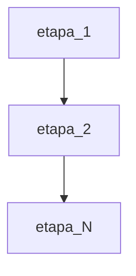

# <PREFIXO>NNN: Plano — <Título>

> **Gerado por `sdd spec new`** a partir de `pipelines.<nome>` do `sdd.config.yaml`: uma fase por
> etapa, na ordem declarada. Este template mostra só a forma — nenhuma etapa é fixa no motor. Uma API
> terá contrato → migration → repositório → serviço → handler; uma CLI, contrato → domínio → comando
> → adaptador; um frontend, contrato → mock → estado → UI. Exemplos em `docs/examples/pipelines/`.

## 🧭 Contexto resumido
> Um parágrafo. Executa a spec `<PREFIXO>NNN` pela pipeline `<nome>`. Objetivo: entregar <X>.

## ✅ Pré-requisitos
- [ ] <bloqueador que precisa estar resolvido antes de iniciar>

## 📅 Fases de trabalho

### Fase 1 — <nome da etapa 1>
- **Etapa da pipeline:** `<id>` · **Agente:** `@<agente da etapa>` · **Quando:** <condição, se houver>
- **Pronto quando:** <saída esperada declarada na etapa>

### Fase N — <etapa com guardian: true>
- **Pronto quando:** cada CA com evidência (implementação + teste; negativo para regra crítica) e
  `GUARDIAN_APPROVED` registrado.

## 🔗 Dependências

## 🎯 Critérios de saída
- [ ] Suíte verde (`commands` da config) com `TEST_PASSED` registrado
- [ ] Cada CA coberto por evidência
- [ ] `sdd check forbidden` no esperado
- [ ] `GUARDIAN_APPROVED` e `SPEC_IMPLEMENTED` registrados; LEDGER regenerado
